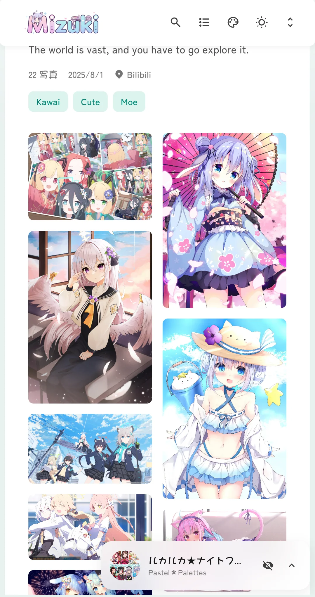
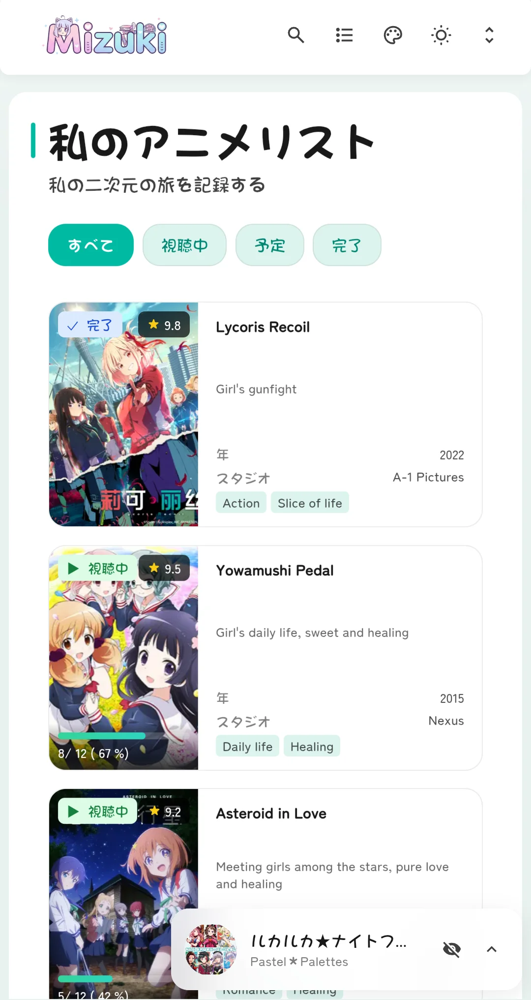

# 🌸 Mizuki


[Astro](https://astro.build) で構築された高度な機能と美しいデザインを備えた、モダンで機能が豊富な静的ブログテンプレート。

[](https://nodejs.org/)
[](https://pnpm.io/)
[](https://astro.build/)
[](https://www.typescriptlang.org/)
[](https://opensource.org/licenses/Apache-2.0)

[**🖥️ ライブデモ**](https://mizuki.mysqil.com/) | [**📝 ドキュメント**](https://docs.mizuki.mysqil.com/)

🌏 **README の言語:**
[**English**](./README.md) / [**中文**](./README.zh.md) / [**日本語**](./README.ja.md) / [**繁體中文**](./README.tw.md) /

包括的なドキュメントですぐに始めましょう。テーマのカスタマイズや機能の設定、本番環境へのデプロイなどブログを完成させるために必要なすべての情報がドキュメントに網羅されています。

[📚 完全なドキュメントを読む](https://docs.mizuki.mysqil.com/) →


<table>
  <tr>
    <td></td>
    <td></td>
    <td></td>
  <tr>
  <tr>
    <td></td>
    <td></td>
    <td></td>
  <tr>
</table>

## ✨ 機能

### 🎨 デザインとインターフェース

- [x] [Astro](https://astro.build)と[Tailwind CSS](https://tailwindcss.com)で構築
- [x] [Swup](https://swup.js.org/)を使用したスムーズなアニメーションとページ遷移
- [x] システム設定検出機能付きのライト/ダークテーマ切り替え
- [x] カスタマイズ可能なテーマカラー、バナーカルーセル、全画面壁紙
- [x] 壁紙モードの切り替えと透明度・ぼかしの調整
- [x] サイドバーのコンポーネント、順序、レスポンシブレイアウトを設定可能
- [x] ワイド画面向けの自動ページスケーリング（オプション）
- [x] すべてのデバイスに対応した完全レスポンシブデザイン
- [x] カスタムフォントまたはシステムフォントモード（JetBrains Mono と CJK フォントを含む）

### 🔍 コンテンツと検索

- [x] [Pagefind](https://pagefind.app/)ベースの高度な検索機能
- [x] 構文強調表示付きの[Markdown と MDX の拡張機能](#-markdown拡張機能)
- [x] 自動スクロール機能付きのインタラクティブな目次
- [x] 記事ページと同じ Markdown/MDX パイプラインを使った全文 RSS/Atom フィード
- [x] 読書時間の推定
- [x] 記事のカテゴリ、タグ、ピン留め、エイリアス、カスタムパーマリンク
- [x] 静的サイト暗号化の限界を明記した、オプションのパスワード保護記事

### 📱 特別ページ

- [x] **アニメページ** - ローカルデータ、Bangumi、Bilibili で視聴状況を管理
- [x] **フレンドページ** - カードとタグで友人のサイトを紹介
- [x] **日記ページ** - 文章、画像、場所、気分、タグ付きの記録を共有
- [x] **アルバムページ** - ローカルまたは外部アルバムを管理し、任意で暗号化
- [x] **プロジェクト、スキル、デバイス、タイムラインページ** - 構造化されたプロフィールデータを表示
- [x] **AI ツールページ** - 検索可能なツール一覧を管理
- [x] **アーカイブと About ページ** - 記事を閲覧し、カスタム紹介を公開

### 🛠 技術的特徴

- [x] [Expressive Code](https://expressive-code.com/)ベースの**拡張コードブロック**
- [x] KaTeX、Mermaid、PlantUML による**数式と図表**
- [x] レスポンシブサイズ、自動グリッド、Fancybox ライトボックスによる**画像拡張**
- [x] サイトマップ、robots.txt、RSS、Atom、任意の Open Graph 画像を含む**SEO最適化**
- [x] 遅延読み込みとキャッシュによる**パフォーマンス最適化**
- [x] Twikoo または Giscus による**コメントシステム**
- [x] ローカルと Meting モードに対応した**音楽プレーヤー**
- [x] Pio による**Live2D マスコット**

## 🚀 クイックスタート

### 📦 インストール

1. **リポジトリをクローン：**

   ```bash
   git clone https://github.com/LyraVoid/Mizuki.git
   cd Mizuki
   ```

2. **依存関係をインストール：**

   ```bash
   # プロジェクトが宣言したパッケージマネージャーを有効化
   corepack enable

   # プロジェクトの依存関係をインストール
   pnpm install
   ```

3. **ブログを設定（オプション）：**
   - ローカルコンテンツだけを使う場合は、ルートの `.env` に `ENABLE_CONTENT_SYNC=false` を設定します。
   - `src/config/siteConfig.ts` と `src/config/` 内の各モジュールを編集してサイトをカスタマイズします。
   - 少なくとも `siteURL` をデプロイ先の公開 URL に変更してください。

4. **開発サーバーを起動：**
   ```bash
   pnpm dev
   ```
   ブログは `http://localhost:3000` で利用可能になります

### 📝 コンテンツ管理

- **投稿を作成：** `pnpm new-post -- <ファイル名>`（`.md` と `.mdx` に対応）
- **投稿を編集：** `src/content/posts/` 内のファイルを修正します。
- **About または Friends の内容を編集：** `src/content/spec/` 内の対応するファイルを編集します。
- **構造化されたページデータを編集：** `src/data/` 内の対応するファイルを編集します。
- **記事専用画像を追加：** 記事の隣に置き、`./cover.webp` のような相対パスで参照します。
- **公開画像を追加：** `public/` に置き、`/images/example.webp` のようなルート相対パスで参照します。

> **公開前に確認：** リポジトリにはサンプル記事、ページデータ、アルバム、画像が含まれています。個人サイトをデプロイする前に削除または置き換えてください。

### 🚀 デプロイ

ブログを任意の静的ホスティングプラットフォームにデプロイ：

- **Vercel：** GitHubリポジトリをVercelに接続
- **Netlify：** GitHubから直接デプロイ
- **GitHub Pages：** 付属のGitHub Actionsワークフローを使用
- **Cloudflare Pages：** リポジトリを接続

デプロイ前に、`src/config/siteConfig.ts` の `siteURL` を更新してください。
`.env` や認証情報を Git にコミットしないでください。ホスティング環境では、プロバイダーの環境変数設定を使用します。

`.env.example` には Bilibili のセッションデータや IndexNow の認証情報など、任意の設定も含まれます。必要な場合だけ設定し、ローカル環境またはホスティングプロバイダーの Secret に保存してください。実際の値はコミットしないでください。

## 📝 コンテンツの執筆

記事は `src/content/posts/` 内の `.md` または `.mdx` ファイルで作成します。必須の frontmatter は `title` と `published` だけで、概要、画像、タグ、カテゴリ、下書き、ピン留め、コメント、エイリアス、パーマリンク、帰属情報、ブラウザー側の暗号化を設定できます。

Markdown と MDX は、コールアウト、KaTeX 数式、Expressive Code、Mermaid、PlantUML、GitHub カード、Wiki Link、スポイラー、レスポンシブ画像、画像グリッド、Fancybox、HTML 埋め込みに対応しています。暗号化記事は RSS/Atom から除外されますが、ブラウザー側の暗号化はサーバー側のアクセス制御ではありません。

PlantUML はデフォルトで `src/config/markdownConfig.ts` に設定された公開サーバーを使用します。図にパスワード、Token、個人情報を含めないでください。

frontmatter の全フィールド、記法、画像ルール、図表、動画埋め込み、暗号化の制限、公開前チェックリストは[コンテンツ執筆ガイド](docs/CONTENT_AUTHORING.ja.md)を参照してください。

## ⚡ コマンド

すべてのコマンドはプロジェクトルートから実行します：

| コマンド | アクション |
| :--- | :--- |
| `pnpm install` | 依存関係をインストール。 |
| `pnpm dev` | `http://localhost:3000` で開発サーバーを起動。 |
| `pnpm build` | `./dist/` をビルドし、検索データとビルドチェックを実行。 |
| `pnpm preview` | 本番ビルドをローカルでプレビュー。 |
| `pnpm run check` | Astro の診断を実行。 |
| `pnpm run type-check` | TypeScript の型チェックを実行。 |
| `pnpm test` | Markdown、レイアウト、画像、音楽、暗号化テストを実行。 |
| `pnpm run format` | Biome でソースをフォーマット。 |
| `pnpm run lint` | Biome でチェックと自動修正。 |
| `pnpm new-post -- <ファイル名>` | Markdown または MDX の記事を作成。 |
| `pnpm run sync-content` | 任意の外部コンテンツリポジトリを同期。 |
| `pnpm run init-content` | 外部コンテンツ同期を対話形式で初期化。 |
| `pnpm astro ...` | Astro CLI コマンドを実行。 |

## 🎯 設定ガイド

### 🔧 基本設定

設定は `src/config/` 以下のモジュールに分割され、`src/config/index.ts` が共通のエクスポート入口です。主要設定は `src/config/siteConfig.ts` にあります：

```typescript
export const siteConfig: SiteConfig = {
  title: "あなたのブログ名",
  subtitle: "あなたのブログの説明",
  siteURL: "https://example.com/", // 末尾のスラッシュを維持
  lang: "ja", // 例: "en"、"zh_CN"、"zh_TW"
  timeZone: "Asia/Tokyo", // 有効な IANA タイムゾーン
  themeColor: {
    hue: 210, // 0–360
    fixed: false, // true で訪問者のテーマカラー選択を非表示
  },
  featurePages: {
    anime: true,
    diary: true,
    friends: true,
    projects: true,
    skills: true,
    timeline: true,
    albums: true,
    devices: true,
    aiTools: true,
  },
  // 残りのフィールドはテンプレートのデフォルトを維持してください。
};
```

その他の主な設定ファイル：

- `src/config/navBarConfig.ts` — ナビゲーションとメニュー。
- `src/config/profileConfig.ts` — アバター、名前、プロフィール、ソーシャルリンク。
- `src/config/sidebarConfig.ts` — サイドバーのウィジェット、順序、位置、レスポンシブ動作。
- `src/config/backgroundWallpaper.ts` と `src/config/effectsConfig.ts` — 壁紙と視覚効果。
- `src/config/commentConfig.ts` — Twikoo または Giscus のグローバル設定。コメントはデフォルトで無効です。使用前に `enable: true` とプロバイダー設定を追加してください。
- `src/config/musicConfig.ts` — 音楽プレーヤーのモードとプレイリスト。
- `src/config/markdownConfig.ts` — Wiki Link、自動画像グリッド、PlantUML。
- `src/config/permalinkConfig.ts` — 任意のグローバルパーマリンク形式。
- `src/config/expressiveCodeConfig.ts` — コードブロックのテーマと動作。

### 📱 機能ページのコンテンツ

ページの有効化は `siteConfig.featurePages` で制御します。ページの内容はテンプレートから分離されています：

| ページ | コンテンツまたはデータ |
| :--- | :--- |
| About | `src/content/spec/about.md` |
| Friends | `src/content/spec/friends.md` と `src/data/friends.ts` |
| Anime | `src/config/siteConfig.ts` でソースモードを設定、ローカルデータは `src/data/anime.ts` |
| Diary | `src/data/diary.ts`、または `diaryApiUrl` の Memos エンドポイント |
| Albums | `public/images/albums/`、各ローカルアルバムは `info.json` を使用 |
| Projects | `src/data/projects.ts` |
| Skills | `src/data/skills.ts` |
| Devices | `src/data/devices.ts` |
| Timeline | `src/data/timeline.ts` |
| AI Tools | `src/data/ai-tools.ts` |

ページの内容を変更するためだけに `src/pages/*.astro` を編集しないでください。これらはレイアウトとレンダリングを定義します。

### 📦 コードとコンテンツの分離（オプション）

Mizuki はテーマコードとブログコンテンツを別のリポジトリに分離できます。プライベートコンテンツ、独立したバージョン管理、チーム協業に便利ですが、必須ではありません。

**簡単選択**:

| 用途 | 設定 | コンテンツの場所 |
| :--- | :--- | :--- |
| **ローカルコンテンツ** | `ENABLE_CONTENT_SYNC=false` | `src/content/`、`src/data/`、`public/images/` |
| **外部コンテンツリポジトリ** | `ENABLE_CONTENT_SYNC=true` と `CONTENT_REPO_URL=...` | 上記のパスへ同期される別リポジトリ |

**ワンクリック有効化/無効化**:

```bash
# ローカルコンテンツモード（入門向け）
# .env に設定して同期を明示的に無効化
ENABLE_CONTENT_SYNC=false
pnpm dev

# 外部コンテンツリポジトリモード
# 1. 設定例をコピー
cp .env.example .env

# 2. .env を編集
ENABLE_CONTENT_SYNC=true
CONTENT_REPO_URL=https://github.com/your-username/Mizuki-Content.git
# CONTENT_DIR=./content  # 任意。デフォルトもこのパスです

# 3. コンテンツを同期してサイトを起動
pnpm run sync-content
pnpm dev
```

外部コンテンツリポジトリは次の構成にできます：

```text
Mizuki-Content/
├── posts/       # .md と .mdx の記事
├── spec/        # About、Friends などの Markdown ページ
├── data/        # プロジェクトやスキルなどの構造化データ
└── images/      # アルバムや記事を含む公開画像
```

同期スクリプトはこれらを `src/content/posts/`、`src/content/spec/`、`src/data/`、`public/images/` にマッピングします。`src/data/ai-tools.ts` はコードリポジトリ側で管理され、同期時も保護されます。

> **同期に関する警告：** `ENABLE_CONTENT_SYNC` を有効にすると、`pnpm dev` と `pnpm build` の前に同期フックが実行されます。`CONTENT_DIR` が Git リポジトリの場合、スクリプトはリモートの `main` または `master` を fetch して reset します。既存のランタイムディレクトリを `.backup` に移動し、ジャンクションまたはコピーを作成し、コードリポジトリに同期結果をコミットする場合もあります。実行前にローカルの変更をコミットまたはバックアップし、同期先を直接編集しないでください。

プライベートリポジトリには SSH URL を使うか、デプロイプロバイダーで認証情報を設定してください。Token を `.env` に書いてコミットしたり、公開 URL に含めたりしないでください。

📖 **詳細設定：** [コンテンツ分離完全ガイド](docs/CONTENT_SEPARATION.md)

🔄 **移行チュートリアル：** [シングルリポジトリから分離モードへ移行](docs/MIGRATION_GUIDE.md)

🚀 **デプロイガイド：** [デプロイガイド](docs/DEPLOYMENT.md)

📚 **その他のドキュメント：** [ドキュメントインデックス](docs/README.md)

## ✏️ 貢献

貢献は歓迎します！お気軽に問題やプルリクエストを提出してください。

1. リポジトリをフォーク
2. 機能ブランチを作成 (`git checkout -b feature/amazing-feature`)
3. 変更をコミット (`git commit -m 'Add some amazing feature'`)
4. ブランチにプッシュ (`git push origin feature/amazing-feature`)
5. プルリクエストを開く

## 📄 ライセンス

このプロジェクトはApacheライセンス2.0の下でライセンスされています - 詳細は[LICENSE](./LICENSE)ファイルをご覧ください。

### 元のプロジェクトライセンス

このプロジェクトは[Fuwari](https://github.com/saicaca/fuwari)に基づいて開発され、元のプロジェクトはMITライセンスを使用しています。MITライセンスの要件に従い、元の著作権表示と許可通知はLICENSE.MITファイルに含まれています。

## 🙏 謝辞

- オリジナルの[Fuwari](https://github.com/saicaca/fuwari)テンプレートをベースにしています
- [Yukina](https://github.com/WhitePaper233/yukina) - 美しくエレガントなブログテンプレートにインスパイアされました
- 一部のデザインは [Firefly](https://github.com/CuteLeaf/Firefly) と [Twilight](https://github.com/spr-aachen/Twilight) テンプレートからインスピレーションを得ています
- [Pio](https://github.com/Dreamer-Paul/Pio)を使用してかわいいLive2D看板娘プラグインを実装
- [Astro](https://astro.build)と[Tailwind CSS](https://tailwindcss.com)で構築
- アイコンは[Iconify](https://iconify.design/)から

### 🌸 特別な感謝

- **[Fuwari](https://github.com/saicaca/fuwari)** by saicaca - このプロジェクトのベースとなるオリジナルテンプレート。このような美しく機能的なテンプレートを作成していただきありがとうございます。
- **[Yukina](https://github.com/WhitePaper233/yukina)** - このプロジェクトの形成に役立ったデザインのインスピレーションと創造性を提供してくれたことに感謝します。Yukinaは優れたデザイン原則とユーザーエクスペリエンスを示す、エレガントなブログテンプレートです。
- **[Firefly](https://github.com/CuteLeaf/Firefly)** - 優れたレイアウトデザインのアイデアを提供していただきありがとうございます。デュアルサイドバーレイアウト、記事の2カラムグリッドレイアウト、およびいくつかのウィジェットのデザインと実装により、Mizukiのインターフェースがより豊かになりました。
- **[Twilight](https://github.com/spr-aachen/Twilight)** - インスピレーションと技術的なサポートを提供していただきありがとうございます。Twilight の動的壁紙モード切り替えシステム、レスポンシブデザイン、およびトランジション効果は、Mizuki のユーザーエクスペリエンスを大幅に向上させました。

## 🍀 コントリビューター

このプロジェクトに貢献してくださったすべてのコントリビューターに感謝します。質問や提案がある場合は、[Issue](https://github.com/LyraVoid/Mizuki/issues)または[Pull Request](https://github.com/LyraVoid/Mizuki/pulls)を提出してください。

<a href="https://github.com/LyraVoid/Mizuki/graphs/contributors">
  
</a>

## ⭐ Star History

## [](https://star-history.com/#LyraVoid/Mizuki&Date)

⭐ このプロジェクトが役立つと思ったら、スターを付けることを検討してください！
