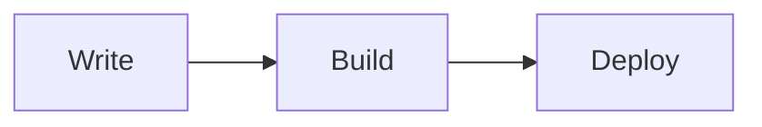
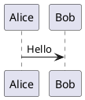

# Content Authoring Guide

This guide covers the content formats supported by Mizuki. It applies whether content is kept in the code repository or synchronized from a separate content repository.

Language versions: [简体中文](CONTENT_AUTHORING.zh.md) · [日本語](CONTENT_AUTHORING.ja.md) · [繁體中文](CONTENT_AUTHORING.tw.md)

## Content locations

In local mode, edit these paths directly:

| Content | Location |
| :--- | :--- |
| Posts | `src/content/posts/` |
| Markdown page content | `src/content/spec/` |
| Structured page data | `src/data/` |
| Public images | `public/images/` |

When content separation is enabled, the external repository maps `posts/`, `spec/`, `data/`, and `images/` to those four runtime locations. Do not edit synchronized runtime files directly.

Posts may use either `.md` or `.mdx`. A post can be a single file or a folder containing `index.md`/`index.mdx` and local assets:

```text
src/content/posts/
└── guides/
    └── getting-started/
        ├── index.md
        └── cover.webp
```

## Frontmatter

Only `title` and `published` are required. The schema supports the following fields:

| Field | Type | Default | Description |
| :--- | :--- | :--- | :--- |
| `title` | string | required | Article title. |
| `published` | date | required | Publication date. |
| `updated` | date | — | Last update date. |
| `draft` | boolean | `false` | Hides the post from production listings when `true`. |
| `description` | string | `""` | Summary for SEO, cards, and previews. |
| `image` | string | `""` | Cover path; supports relative, root-relative, and remote URLs. |
| `tags` | string[] | `[]` | Tags used for organization and filtering. |
| `category` | string or null | `""` | Article category. |
| `lang` | string | `""` | Article language when it differs from the site language. |
| `pinned` | boolean | `false` | Places the post before regular posts. |
| `priority` | number | — | Sorts pinned posts; lower values come first when both posts define it. |
| `comment` | boolean | `true` | Enables the article comment area when the global comment system is enabled. |
| `author` | string | `""` | Optional author attribution. |
| `sourceLink` | string | `""` | Optional source or reference URL. |
| `licenseName` | string | `""` | Optional license name for the article. |
| `licenseUrl` | string | `""` | Optional license URL. |
| `encrypted` | boolean | `false` | Enables browser-side password protection. |
| `password` | string | `""` | Password used for the encrypted post. |
| `passwordHint` | string | `""` | Optional hint shown in the password prompt. |
| `hideHomeContent` | boolean | — | Hides the public home/list summary; posts with a password hide it by default. |
| `alias` | string | — | Alternate URL under `/posts/`. |
| `permalink` | string | — | Custom URL at the site root; takes precedence over `alias`. |

Example:

```yaml
---
title: "My First Blog Post"
published: 2026-08-09T13:00:00+08:00
updated: 2026-08-10
description: "A short description for previews and SEO."
image: ./cover.webp
tags: [Astro, Blogging]
category: Guides
draft: false
pinned: false
comment: true
lang: en
author: "Your Name"
---
```

Date-only values such as `published: 2026-08-09` are also valid. Use a timezone-qualified ISO timestamp when the exact instant matters. Do not add legacy `date` or `pubDate` fields; the current schema uses `published`.

### Drafts and pinned posts

Set `draft: true` while writing. Drafts are available during development but are excluded from production listings and feeds.

Set `pinned: true` to place a post before regular posts. Pinned posts use `priority` when available, then fall back to publication date.

### Aliases and permalinks

An alias stays under `/posts/`:

```yaml
alias: "my-special-article"
```

A permalink is rooted at the site URL and has higher priority than an alias:

```yaml
permalink: "notes/my-special-article"
```

Do not include leading or trailing slashes. Keep aliases and permalinks unique across the site.

### Post encryption

```yaml
encrypted: true
password: "use-a-strong-password"
passwordHint: "Optional hint for readers"
hideHomeContent: true
```

Mizuki encrypts the rendered post for browser-side decryption. This is not server-side access control: the encrypted payload is still distributed with the static site, and a determined visitor can download or analyze it. Do not use this feature for credentials, private keys, or highly sensitive information. Encrypted posts are excluded from RSS and Atom feeds.

## Markdown and MDX

Standard Markdown, HTML, and `.mdx` files are supported. MDX can use imported Astro/Svelte components and client directives when those components are part of the project.

### Callouts

Directive callouts:

```markdown
:::note[Optional title]
This is an informational note.
:::

:::warning{title="Be careful"}
This is a warning.
:::
```

The primary directive types are `note`, `tip`, `important`, `warning`, and `caution`. Common aliases such as `info`, `success`, `danger`, and `example` are also mapped to the available styles.

GitHub-style callouts are supported as well:

```markdown
> [!NOTE]
> This is an informational note.

> [!WARNING]
> This is a warning.
```

### Code blocks

Fenced code blocks use Expressive Code. The theme provides syntax highlighting, line numbers, language labels, copy controls, code groups, and automatic collapsing for long blocks.

### Math

Use `$...$` for inline math and `$$...$$` for display math. KaTeX renders the result during the build.

### Mermaid and PlantUML

Mermaid diagrams use a `mermaid` fence:

````markdown

````

PlantUML diagrams use a `plantuml` fence:

````markdown

````

PlantUML source is encoded into an image URL and, by default, sent to the public server configured in `src/config/markdownConfig.ts`. Do not put passwords, tokens, personal data, or other confidential information in a diagram. Use a self-hosted server or disable the feature when public rendering is not appropriate.

### GitHub cards, Wiki Links, and spoilers

Embed a GitHub repository card with:

```markdown
::github{repo="owner/repository"}
```

Link to another post with a Wiki Link:

```markdown
[[guides/getting-started]]
[[guides/getting-started#installation|Read the installation section]]
```

A Wiki Link on its own line becomes a post card. Inline Wiki Links become regular internal links.

Spoilers are visual masking only:

```markdown
The answer is :spoiler[hidden text].
```

Do not use spoilers as a security feature. Use post encryption when a password prompt is appropriate, while keeping its static-site limitations in mind.

### Images

Relative images are resolved from the current post directory. Root-relative paths refer to `public/`, and HTTP(S) URLs refer to remote images:

```markdown


```

Use a title for a caption and add `w-N%` to the alt text for a centered width from 1% to 100%:

```markdown

```

### Image grids

Use an explicit grid when you need control over columns, aspect ratio, or fitting:

```markdown
:::grid{columns="3" aspect="16/9" fit="cover"}


:::
```

`columns` accepts 1–6, `aspect` must be a positive ratio, and `fit` is `cover` or `contain`. The default configuration also converts consecutive image-only paragraphs into an automatic grid of up to four columns. Each grid has its own Fancybox lightbox group.

### Video embeds

When a provider allows embedding, paste its iframe into the Markdown or MDX file. For example, YouTube and Bilibili both provide an Embed option. Avoid autoplay unless it is explicitly appropriate for the site.

## Examples in this repository

The following are real articles under [`src/content/posts/`](../src/content/posts/). They are useful as focused examples, but they are demo content; remove or replace them before deploying your own site.

| Topic | Example |
| :--- | :--- |
| Folder-based post layout and a basic article | [`guide/index.md`](../src/content/posts/guide/index.md) |
| Standard Markdown basics | [`markdown-tutorial.md`](../src/content/posts/markdown-tutorial.md) |
| Callouts, GitHub cards, Wiki Links, and other extensions | [`markdown-extended.md`](../src/content/posts/markdown-extended.md) |
| Mermaid flowcharts and other diagram types | [`markdown-mermaid.md`](../src/content/posts/markdown-mermaid.md) |
| Image grids, captions, responsive behavior, and lightbox groups | [`image-grid-demo.md`](../src/content/posts/image-grid-demo.md) |
| YouTube and Bilibili iframe embeds | [`video.md`](../src/content/posts/video.md) |
| Browser-side encrypted posts | [`encrypted-post.md`](../src/content/posts/encrypted-post.md) |
| MDX imports, JavaScript exports, and Astro components | [`content-pipeline-fixture.mdx`](../src/content/posts/content-pipeline-fixture.mdx) |

The older demo articles may show fields that are no longer part of the current schema. For new posts, follow the schema in this guide and treat the source code as authoritative.

## Content and feeds checklist

Before publishing:

1. Check required frontmatter and date formats.
2. Verify image paths, filename casing, and remote URLs.
3. Close every callout, grid, code fence, and diagram block.
4. Confirm aliases and permalinks are unique.
5. Keep secrets out of PlantUML, MDX, public images, and article content.
6. Remove or replace the repository's demo posts, page data, and images before deploying a personal site.

For a broader rendering overview, see [Content Rendering](CONTENT_RENDERING.md). The repository also includes working examples under `src/content/posts/`.
